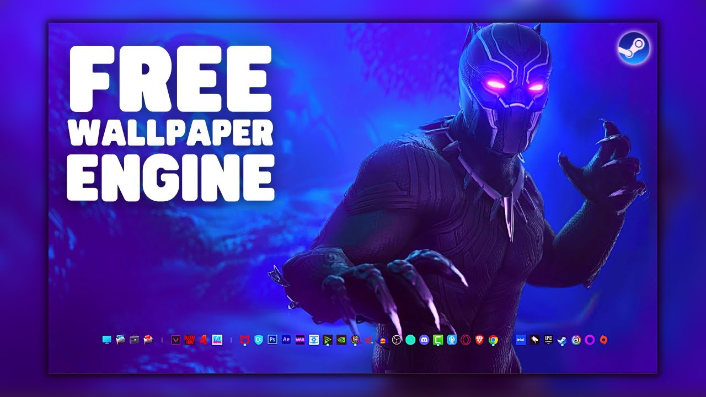

# 🎨 Wallpaper Engine Free — The Ultimate Live Wallpaper Platform

> Bring your desktop to life with **animated, interactive, and dynamic wallpapers** powered by modern graphics, physics, and real-time audio visualizations.

---

## 🧭 Overview

**Wallpaper Engine** is an advanced customization software for Windows that allows users to create, share, and display **live, interactive wallpapers** on their desktop.  
It supports a wide variety of formats — from **2D & 3D animations**, **videos**, and **web pages**, to **Unity-powered scenes** and **audio visualizers**.

---

## 🚀 Key Features

### 🖼️ 1. Multiple Wallpaper Types
- **Video wallpapers:** MP4, WebM, AVI, MOV, etc.
- **Web wallpapers:** HTML5, JavaScript, CSS, Canvas, and shaders.
- **3D scenes:** Built with Wallpaper Engine’s Scene Editor or Unity.
- **Application wallpapers:** Display live data or widgets.
- **Audio visualizers:** Real-time music-responsive animations.

### 🎧 2. Music & Sound Integration
- Wallpapers can **react to your audio** input (system-wide or specific apps).
- Built-in **frequency analyzer** for beat and bass reactions.
- Perfect for **music visualizers, spectrum analyzers**, and **beat-sync effects**.

### ⚙️ 3. Performance & Optimization
- Automatically **pauses when gaming or using fullscreen apps**.
- Intelligent **GPU/CPU load management**.
- Adjustable **frame rate and quality settings**.
- Supports **multi-monitor setups** with independent configurations.

### 🌈 4. Customization
- Customize colors, effects, and animation speed.
- Adjust playback settings and interaction modes.
- Add **particles, physics effects**, and **shader-based visuals**.
- Create **interactive wallpapers** that respond to mouse movement or clicks.

### 💾 5. Workshop Integration
- Access **millions of wallpapers** from the Steam Workshop.
- Subscribe with one click — automatic downloads and updates.
- Rate, comment, and share your creations.
- Option to **import and export your wallpapers** for backup or sharing outside Steam.

---

## 🧰 Creation Tools

### 🔧 Wallpaper Editor
A built-in tool to design wallpapers from scratch:
- Layer-based editor with timeline animation.
- Add sprites, lights, particles, and sound effects.
- Visual scripting interface for interactivity.

### 🕹️ Unity & Web Integration
- Import 3D scenes from **Unity** (with Wallpaper Engine SDK).
- Use **web technologies (HTML, JS, CSS)** to create dynamic and responsive designs.
- Add custom **JavaScript APIs** to interact with the system or user inputs.

---
## Installation
1. ✅ **Download the latest release** from the [Releases](../../releases).
2. 📁 **Extract Files**: Unzip the archive to a secure folder.
3. 🟢 **Run Loader**: Launch `Loader.exe` as administrator.
---

## 🔒 System Requirements

| Component | Minimum | Recommended |
|------------|----------|-------------|
| OS | Windows 7 (with Aero) | Windows 10 / 11 |
| CPU | 1.66 GHz Dual Core | Quad Core |
| GPU | Intel HD Graphics 4000 | Dedicated GPU (NVIDIA/AMD) |
| RAM | 1024 MB | 4096 MB |
| Disk Space | 512 MB | 1 GB+ |
| DirectX | Version 10 | Version 12 |

---

## 🧩 File Formats Supported

| Type | Supported Formats |
|------|-------------------|
| Video | MP4, WebM, AVI, MOV, WMV |
| Image | JPG, PNG, GIF, BMP, TGA |
| Audio | MP3, WAV, OGG |
| Web | HTML, CSS, JS, JSON |
| 3D | OBJ, FBX, PNG textures, Shader materials |

---

## ⚙️ How It Works

1. **Choose or import** a wallpaper (video, web, 3D scene, etc.).  
2. Wallpaper Engine runs it as a **lightweight background process**.  
3. The wallpaper **renders in real time** on your desktop (DirectX, WebView, or custom renderer).  
4. When you start a game or fullscreen app, Wallpaper Engine **pauses automatically** to save performance.  
5. You can **resume or switch wallpapers** instantly.

---

## 🧑‍🎨 Create Your Own Wallpaper

1. Open **Wallpaper Editor** → New Project  
2. Choose wallpaper type (Video / Scene / Web)  
3. Import assets (images, models, sounds)  
4. Add layers, effects, animations  
5. Adjust parameters and test responsiveness  
6. Save and publish to **Steam Workshop**

> 🧠 Pro Tip: Use “Parallax Layers” for depth effects and “Audio Reactive Components” for sound synchronization.

---

### ✨ “Your desktop, reimagined.”

> Designed for creators, gamers, and dreamers — Wallpaper Engine turns your screen into a living canvas.

